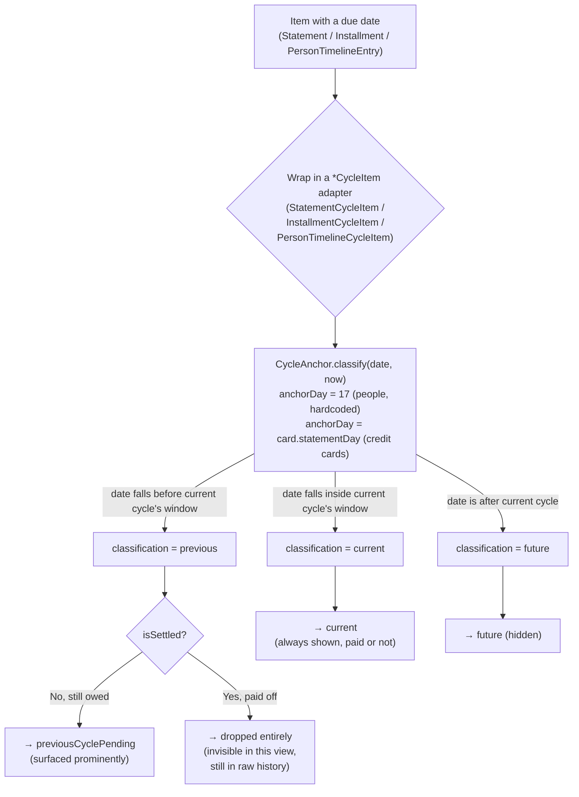
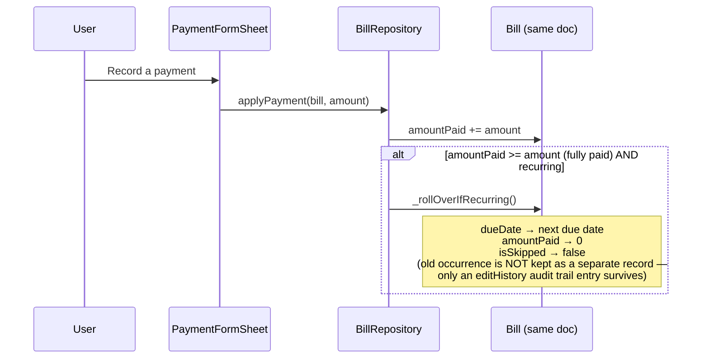
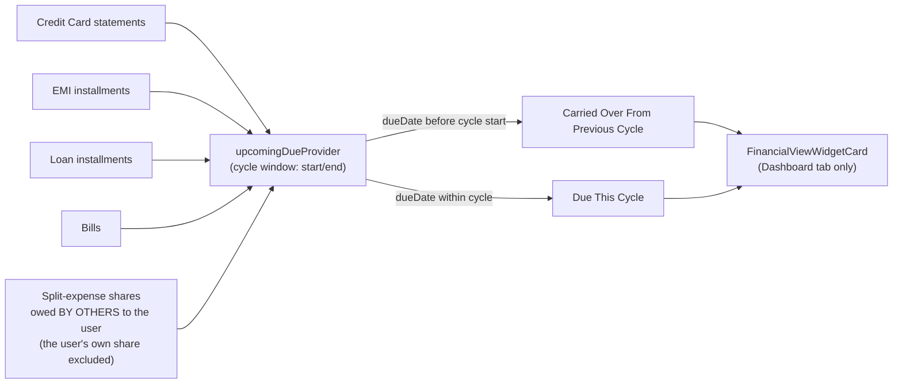
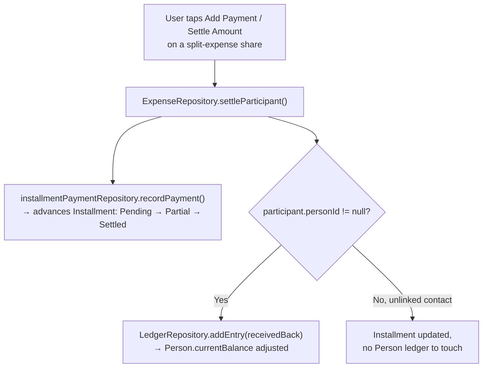

# Audit: Cycle (Carry-Forward) Process, Bill Handling, Dashboard, and Settlement — What's Actually Done & Connected to UI

**Scope:** answers, with file:line evidence, to: how the app currently handles a "previous cycle still-pending due" alongside a "current cycle's new due" (e.g. card bill generated the 17th, paid the 5th next month); how Bills are handled today; what the Dashboard currently shows per navigation screen; and how expense settlement/missed-payment carry-forward works for People / Split Expense / My Expense.

**Method:** every claim below was verified by reading the actual current working-tree code (as of 2026-07-23, on top of uncommitted WIP — see `git status`), not inferred from docs or memory. Docs consulted for background only: `docs/monthly-settlement-view-task.md` (the original spec for this feature), `docs/expense-flow-design-analysis.md` (settlement state machine spec).

**Rule used throughout:** a feature is only marked ✅ **Done (UI)** if it renders on a real screen the user can navigate to today. Backend logic that exists but nothing displays is marked ⚠️ **Built, not surfaced**. Anything absent is ❌ **Not implemented**.

---

## 0. One-paragraph answer to "what's the current situation"

A generic **Carry-Forward Engine** (`lib/core/payment_schedule/domain/{cycle_anchor,cycle_period,cycle_item,cycle_source_type,cycle_engine}.dart`) now exists and is wired, end-to-end into the UI, for exactly **two** features: **Credit Cards** and **People / Split Expenses**. Both show a "Previous Cycle Pending" + "Current Cycle" split on their detail screens. **Bills, EMI, and Loans are not wired into this engine at all** — Bills still has no adapter, and the only place a user sees "carried over" language for Bills/EMI/Loans is one shared Dashboard widget (Financial View card), not their own screens. This is broader and structurally different from what `docs/monthly-settlement-view-task.md` originally scoped (see §7).

---

## 1. Summary table — done & UI-visible vs not

| Feature | Cycle engine wired? | "Previous cycle pending" visible in its OWN screen? | Where exactly | Status |
|---|---|---|---|---|
| **Credit Cards** | ✅ Yes (`StatementCycleItem`) | ✅ Yes | `CreditCardDetailScreen` — "Previous Cycle Pending" + "Current Cycle" sections | ✅ Done, **but has a display bug** (§3.3) |
| **People / Split Expense** | ✅ Yes (`PersonTimelineCycleItem`) | ✅ Yes | `PersonStatementScreen` History tab — "Previous Cycle Pending" + "Current Cycle" sections | ✅ Done |
| **Bills** | ❌ No adapter exists | ❌ No | — | ⚠️ Only visible indirectly via Dashboard Financial View widget (§5.4), not on `BillsScreen`/`BillDetailScreen` |
| **EMI** | ⚠️ Adapter exists (`InstallmentCycleItem`) but **zero consumers** | ❌ No | — | ⚠️ Same as Bills — only via Dashboard Financial View widget |
| **Loans** | ⚠️ Same adapter, zero consumers | ❌ No | — | ⚠️ Same as Bills |
| **Dashboard (cross-domain)** | Indirect (bespoke, not `CycleEngine`) | ✅ Yes, for Credit Cards + EMI + Loans + Bills + Split-expense-others'-shares | `FinancialViewWidgetCard` → "Carried Over From Previous Cycle" / "Due This Cycle" | ✅ Done, but this is a **second, separate implementation** of the same idea (§7) |
| **Plain People ledger (lending, manual settlements, adjustments)** | ❌ Deliberately excluded | ❌ No | — | ❌ Not implemented — stays a flat running balance forever, no cycle concept (by design, see §6.3) |

---

## 2. How the cycle-classification logic actually works (backend, shared by everything above)

`CycleEngine.classifyForCarryForward` (`lib/core/payment_schedule/domain/cycle_engine.dart:103-123`) is the single pure function behind every "Previous Cycle Pending" section in the app. It is feature-agnostic — it only ever looks at `cycleDate`, `isSettled`, `carryForwardEligible` on the generic `CycleItem` interface, never at Statement/Installment/PersonTimelineEntry directly.

---

## 3. Credit Cards — the most complete implementation

### 3.1 What's done and where it shows (✅ UI-verified)

On **`CreditCardDetailScreen`** (`lib/features/credit_cards/presentation/screens/credit_card_detail_screen.dart`):

- **"Previous Cycle Pending" section** (`:179-193`) — renders only when non-empty. Each row is a still-unpaid statement from a *closed* prior cycle.
- **"Current Cycle" section** (`:194-201`) — the live, in-progress cycle's running total (not yet closed/materialized), not tappable (no statement document exists for it yet).
- **"Statements" section** (`:202-221`) — full history, every entry also flagged if it's the same one shown in "Previous Cycle Pending."
- Each row has a status pill: **"Carried Forward"** (warning-orange) for previous-cycle-pending items, else normal Paid/Due Soon/Overdue/Partially Paid (`payment_urgency.dart`).
- `_CardUsageCard`'s "This cycle" mini-stat (`:397`) shows the live current-cycle spend next to "Available" credit.
- Drilling into a statement (`StatementDetailScreen`) correctly shows separate Paid / Remaining amounts.

### 3.2 What's NOT done here

- **No cycle switcher** (prev/next chevrons) — you page through cycles by tapping individual statements in the flat history list, not a dedicated switcher.
- **No plain-language copy** — labels are "Previous Cycle Pending" / "Current Cycle", not the "Spent this month" / "Still to pay from last month" wording the original plan doc specified.
- `credit_cards_screen.dart` (the card wallet/list screen) has **no** previous-vs-current distinction at all — only aggregate "Outstanding"/"Available"/"Due <date>".

### 3.3 ⚠️ Correctness defect — Medium/High severity

`_StatementTile` (`credit_card_detail_screen.dart:486`) always renders `statement.totalAmount` — the **full original bill amount** — even for a statement flagged `isCarriedForward: true`. It should render `statement.remainingAmount` (what's actually still owed after any partial payment). If a user partially paid last cycle's bill, the "Previous Cycle Pending" section **overstates** what they still owe. This is the single most load-bearing number for the exact feature the user asked about ("prev 17th pending due"), so it's worth fixing before relying on this screen for real numbers. (The drill-down `StatementDetailScreen` shows the correct Paid/Remaining split — only the summary tile on the detail screen is wrong.)

### 3.4 No test coverage

No test exercises `statementCycleViewProvider` or the "Previous Cycle Pending"/"Current Cycle" sections — the amount-display bug above would not be caught by `flutter test` today.

---

## 4. Bills — how to handle bills right now (current, real behavior)

### 4.1 The model — one mutable document, not a history

`Bill` (`lib/features/bills/domain/bill.dart`) is **one document per recurring bill**, not one document per occurrence. `status` is always computed live from `amountPaid`/`isSkipped`/`dueDate` vs today — never stored.

### 4.2 What this means for "previous due + current due" on Bills specifically

**There is no simultaneous previous-pending + current-due state for a single bill.** A `Bill` is always exactly one occurrence. If it's overdue and unpaid, it just sits as `status == overdue` indefinitely (rollover is **not** time-driven — confirmed no cron/scheduled trigger; it only fires from `applyPayment`/`markPaid`/`skipOccurrence`). The moment you pay it in full, it silently advances to the next due date and the fact that it was ever late is lost (only the audit-trail note survives, not a distinct "previous occurrence" record).

**How to handle a bill today, practically:**
- Overdue/unpaid bills stay visible under the "Overdue" group on `BillsScreen` until acted on — nothing is silently lost while unpaid.
- The only reachable action from the UI is **recording a payment** via the FAB → `PaymentFormSheet` (partial or full).
- ⚠️ `BillRepository.markPaid` and `skipOccurrence`/`unskip` exist in the repository but have **zero UI call sites** — "mark paid" and "skip" are currently dead/unreachable from the app as shipped. If you need to skip a bill occurrence, there is currently no UI path to do it.

### 4.3 UI-visible today (✅)

- `BillsScreen`: bills grouped by status (Overdue, Due Today, Partially Paid, Upcoming, Skipped, Paid).
- `BillDetailScreen`: due date, status pill, amount-paid progress bar, recurrence label, payment history list.
- `BillTile`: status-colored icon, remaining amount, status label.

### 4.4 NOT done (❌)

- No adapter into `CycleEngine` (`BillCycleItem` doesn't exist).
- No "previous cycle still owed" section anywhere in the Bills feature's own screens.
- The **only** place a Bill's carry-over shows up in the UI at all is the Dashboard's Financial View widget (§5.4) — a completely separate, bespoke implementation, not `Bill`'s own screens.
- This matches the accepted, previously-noted limitation: Bills can't adopt the engine until the in-place-overwrite rollover is fixed to preserve prior occurrences as distinct records.

---

## 5. Dashboard — current features per navigation screen

### 5.1 Top-level navigation (bottom nav bar, in order)

| # | Tab | Screen file | What's actually on it (verified by reading the build methods) |
|---|---|---|---|
| 1 | **Dashboard** | `dashboard_screen.dart` | Greeting header + edit-mode toggle. View Mode: the user's configured widget layout (Net Worth, Financial View, Accounts, Credit Cards, People, Quick Actions — whichever are visible) + one consolidated "Coming Soon" card listing every unbuilt widget type. Edit Mode: reorderable list with drag handle / configure / hide / delete per widget. |
| 2 | **History** | `transactions_screen.dart` | Unified activity feed. Search, filters, SMS Inbox link, Trash. "All"/"Transactions" filter shows date-grouped transactions with swipe-to-delete; every other filter chip shows a read-only unified feed mixing split expenses, loan/bill/EMI payments, and receipts. |
| 3 | **Cash Flow** | `cash_flow_screen.dart` | 5 stacked cards: Payments Due, Money to Receive, Upcoming Payments Timeline, Credit Card Statement Summary, Cash Flow Summary — all reused from existing aggregation providers. |
| 4 | **People** | `people_screen.dart` | Contact list with search, filter chips, sort, an Overall Balance card (net across everyone), FAB to add a person. `/creditors` and `/debtors` are separate filtered routes, not tabs on this screen. |
| 5 | **More** | `more_screen.dart` | Settings-style list: Reports, Settings, Credit Cards, Savings Goals, Categories, Backup & Restore ("coming soon"), Trash, About. |

A central gradient **"+" FAB** (not a 6th tab) opens a quick-add-entry menu. Credit Cards, Reports, Settings, Savings, Categories, Loans, EMIs, Bills, Calendar, Search, Accounts, Trash, About, SMS Inbox, Budget are all real, reachable screens — but as **pushed** routes from Dashboard/More, not top-level nav.

### 5.2 Dashboard widget catalog — built vs still "coming soon"

**✅ Built and rendering today:** Net Worth, Financial View, Accounts, Credit Cards, People, Quick Actions.

**❌ Not built** (fall through to a generic "coming soon" placeholder): Upcoming Payments, Bills, EMI, Loans, Split Expenses, Savings Goals, Recent Activity, Budget Progress, Cash Flow, Spending Categories, Insights, Calendar — 12 of the 18 planned widget types.

**Edit Mode is real**, not a mockup: drag-to-reorder (`ReorderableListView`), hide/show toggle, delete, and a configure sheet — but the configure sheet only actually does something for the Financial View widget type; other types' gear icon is currently a no-op. No "Add Widget" entry point was found wired up yet.

### 5.3 The Financial View widget — where cross-domain carry-forward actually lives

This is the one dashboard widget that shows a "previous vs current" split, and it covers more domains than Credit Cards' own screen does:

- Headline: this cycle's total for whichever module (My Expenses / Shared / Combined / Income / Net Cash Flow) + a "↑/↓ N% vs last pay period" pill.
- **"Carried Over From Previous Cycle" / "Due This Cycle"** sections (`_UpcomingDueSection`) — this is fed by a new provider, `upcomingDueProvider`.

### 5.4 `upcomingDueProvider` — the real cross-domain aggregator

This answers "is Bills/EMI/Loans connected to any UI for previous-vs-current at all?" — **yes, exactly here**, and only here. It is **not** built on `CycleEngine`/`CycleItem` — it's a separate, bespoke `isCarriedOver = dueDate.isBefore(cycleStart)` check, duplicating the same idea a second way (see §7 for why that matters). Plain People/ledger balances are deliberately excluded from this aggregator (a `Person` balance has no due date).

---

## 6. Settlement of expenses — People / Split Expense / My Expense

### 6.1 How a settlement is actually recorded (the write path)

Two screens funnel into this exact call: `RecordSplitPaymentSheet` (Advance/Settle toggle) and `SettleAmountSheet` (the guarded "zero it out" flow), both matching the state machine `docs/expense-flow-design-analysis.md` originally spec'd (Pending → Partial → Settled, Overdue as a time-derived overlay).

### 6.2 ⚠️ A real seam worth knowing about

`SettleUpSheet`'s **"All pending"** and **"Custom amount"** modes (person-level "Receive Money" flow), plus `PersonStatementScreen`'s **"Settle All"** menu action, post a **lump-sum ledger entry directly** — they do **not** call `settleParticipant`, so they never touch the underlying `Installment` for any specific expense. Result: a user can zero out a person's balance this way while individual expenses underneath still show "Pending"/"Overdue" status, because nothing told their `Installment` it was paid. Only the **"Specific expense"** mode in `SettleUpSheet` goes through the correct per-installment path.

### 6.3 What happens to a missed/unsettled split expense across the month boundary — the direct answer

**✅ Done and UI-visible, for split/assigned expenses specifically:**

On `PersonStatementScreen`'s **History tab**, a hardcoded 17th-of-month cycle boundary (`CycleAnchor(anchorDay: 17)`, not yet configurable per person or app-wide) classifies every split/assigned-expense share the same way Credit Cards are classified:
- Still unsettled once the 17th passes → surfaces at the top of the next cycle in a **"Previous Cycle Pending"** section, each row visually flagged (warning tint, left border, "CARRIED FORWARD · PREVIOUS CYCLE PENDING" label).
- Settled before the boundary → disappears from this attention-grabbing view (still visible in plain history, just not flagged).
- "Overdue" is a separate, independent status (from the underlying `Installment`'s own due date) — an item can be "Overdue" and still sit inside "Current Cycle" if its due date passed but the calendar cycle boundary hasn't.

**❌ Not implemented — "My Expense" and plain People-ledger items:**

- Plain lending, manual settlements, adjustments, and reference-only transactions have **zero** cycle concept — they live in the flat running balance forever with no "carried from last month" language anywhere, by explicit design (a flat balance has no natural due date to classify against).
- There's no persisted "carried forward N times" / aging counter — the carry-forward flag is recomputed live every time the screen is opened (`CycleAnchor.classify(now)`), so nothing is stored as a distinct state transition; it's presentation-only.
- The exported **PDF statement** (`StatementPdfPreviewScreen` / `StatementPdfBuilder`) does **not** reflect any of this — it's a flat chronological transaction table with per-row status pills, no "Previous Cycle Pending" section, no cycle anchor at all. If you rely on the PDF to see what's overdue-from-last-cycle vs new, it won't show that distinction; only the in-app History tab does.
- "My Expense" (money the user spent that wasn't split with anyone) has no settlement concept at all — settlement only applies to money *other people* owe back, which is inherent to what settlement means, but worth stating explicitly since the question named it.

---

## 7. Cross-cutting findings (things to know before building on any of this)

1. **Two independent "carried forward" implementations exist side by side** — `CycleEngine`/`CycleItem` (used by Credit Cards + People) and the separate `isCarriedOver` cutoff check inside `upcoming_due_provider.dart` (used by Dashboard's Financial View widget for Bills/EMI/Loans/Credit Cards/Split-expense-others'-shares). They agree conceptually but are two different code paths computing the same idea, which is exactly what the shared engine was meant to prevent going forward.
2. **The originally-approved plan (`docs/monthly-settlement-view-task.md`) scoped a small, per-card-only feature and required a scope confirmation (§5 of that doc, via `AskUserQuestion`) before going broader.** What's actually in the working tree is a larger, generic, cross-feature engine touching Credit Cards + EMI/Loans (partially) + People, with no evidence that broader-scope confirmation happened. Worth flagging in case this was meant to stay smaller.
3. **`InstallmentCycleItem` (the EMI/Loan adapter) has zero consumers** — it exists but nothing calls it, so EMI/Loans get no benefit from the engine in their own screens today; their only carry-forward visibility is the shared Dashboard widget's bespoke path.
4. **No tests cover any of the "Previous Cycle Pending" UI paths** — not for Credit Cards, not for People. The Credit Card amount-display bug (§3.3) would not be caught by the current test suite.
5. **Bills is the clear next gap** if the goal is consistency: it has no adapter, no UI section on its own screens, and its rollover-in-place behavior (§4.1) actively prevents adopting the engine until fixed to preserve prior occurrences as distinct records.

---

## 8. Direct answers to the questions asked

- **"How to handle bills now?"** → Bills has no previous-vs-current cycle UI on its own screens. Pay via the FAB → Record Payment; overdue bills stay visible under "Overdue" until paid (nothing lost while unpaid). Recurring bills roll to the next due date **only** when paid in full — the previous occurrence is not preserved separately. "Mark paid" and "Skip" exist in code but aren't reachable from any screen today.
- **"How to handle both processes (prev 17th pending due + current due)?"** → Fully working today for **Credit Cards** (`CreditCardDetailScreen`, anchored to each card's own statement day) and **People/Split Expense** (`PersonStatementScreen` History tab, hardcoded to the 17th for everyone). Not present at all for Bills/EMI/Loans on their own screens — only via the Dashboard's Financial View widget.
- **"Connected in UI? Which part?"** → See §1's table and §3/§5/§6 for the exact screen + section name for each feature.
- **"Settlement of exp, missed exp next month — people session, split exp, my exp"** → See §6.3: implemented and UI-visible for split/assigned expenses via the "Previous Cycle Pending" section; not implemented for plain People-ledger items or "my expense" (no settlement concept applies to your own spending); the PDF export does not carry this distinction.
